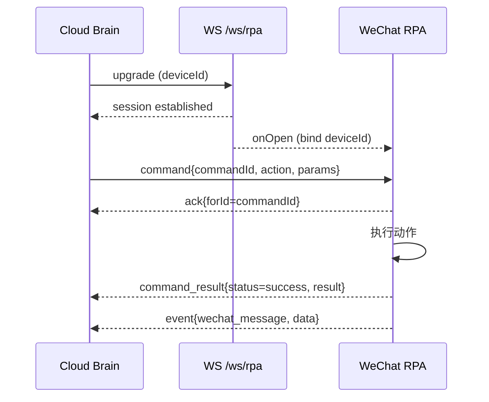

# WeChat RPA WebSocket 消息协议（MVP）

本文档定义 Cloud Brain 与 WeChat RPA 之间基于 WebSocket 的通信协议（MVP 版本）。适用于 `apps/cloud-brain` 服务的 `/ws/rpa` 端点。

- 状态：MVP/稳定（可随业务演进按版本增量扩展）
- 作用域：仅包含三类动作 `send_text`、`send_image`、`send_file` 的下行指令与结果回传，并支持上行微信自然事件与状态上报。
- 边界：WeChat RPA 客户端在独立工程实现；本项目仅提供服务端网关、Spring AI Tool 与状态面板。

---

## 1. 端点与连接

- WebSocket 端点：`GET /ws/rpa?deviceId={string}`
- 查询参数：
  - `deviceId`（必填）：RPA 客户端设备标识。
- 协议：标准 WebSocket，文本帧传输 JSON。
- CORS：MVP 阶段允许任意来源（仅用于开发联调）。
- 鉴权：MVP 暂不实现。后续将采用 `Authorization: Bearer <JWT>` Header + 租户隔离。

> 在线状态以 WebSocket 会话是否存活为准。服务端记录 `connectedAt/lastSeenAt/disconnectedAt`。

---

## 2. 消息通用结构（Envelope）

所有消息均采用相同的顶层结构：

```json
{
  "type": "command|command_result|event|ack|error|status",
  "traceId": "uuid",
  "deviceId": "string",
  "timestamp": 1739420800123,
  "payload": {}
}
```

- `type`：消息类型枚举（见下文）。
- `traceId`：端到端链路追踪 ID（服务端下发时生成；客户端可沿用或生成）。
- `deviceId`：设备标识，须与连接参数一致。
- `timestamp`：毫秒时间戳（UTC）。
- `payload`：具体类型对应的负载内容。

---

## 3. 消息类型与负载

### 3.1 下行指令（type=command）

```json
{
  "type": "command",
  "traceId": "uuid",
  "deviceId": "wxrpa-001",
  "timestamp": 1739420800123,
  "payload": {
    "commandId": "uuid",
    "action": "send_text|send_image|send_file",
    "params": {},
    "timeoutMs": 8000
  }
}
```

- `commandId`：全局唯一 ID，用于幂等与结果对齐。
- `action`：动作枚举，仅限 `send_text|send_image|send_file`。
- `params`：动作参数（见 4 章）。
- `timeoutMs`：期望同步完成时间。若超时，服务器可返回“已下发待回调”，客户端仍可在完成后发送 `command_result`。

### 3.2 执行结果（type=command_result，上行）

```json
{
  "type": "command_result",
  "traceId": "uuid",
  "deviceId": "wxrpa-001",
  "timestamp": 1739420802123,
  "payload": {
    "commandId": "uuid",
    "status": "success|failed|timeout|rejected",
    "result": { "messageId": "wxmsg-001" },
    "error": { "code": "RPA_EXEC_ERROR", "message": "detail" }
  }
}
```

- `status`：
  - `success`：成功完成。
  - `failed`：执行失败（详见 `error`）。
  - `timeout`：超过 `timeoutMs` 后才完成（或仍未完成）。
  - `rejected`：参数不合法、权限不足或设备状态不允许等。

### 3.3 事件（type=event，上行）

```json
{
  "type": "event",
  "traceId": "uuid",
  "deviceId": "wxrpa-001",
  "timestamp": 1739420801123,
  "payload": {
    "eventType": "wechat_message",
    "data": {
      "messageId": "wxmsg-002",
      "from": "wx_user_id",
      "chatId": "chat_or_room_id",
      "msgType": "text|image|file|system",
      "content": "文本或简要描述",
      "raw": {}
    }
  }
}
```

### 3.4 确认与错误（type=ack|error）

- `ack`：可选，收到 `command` 后快速回执。

```json
{ "type": "ack", "traceId": "uuid", "deviceId": "wxrpa-001", "timestamp": 1739420800124, "payload": { "forType": "command", "forId": "commandId" } }
```

- `error`：早期校验/解析失败时返回。

```json
{ "type": "error", "traceId": "uuid", "deviceId": "wxrpa-001", "timestamp": 1739420800124, "payload": { "forType": "command", "forId": "commandId", "code": "INVALID_PARAMS", "message": "..." } }
```

### 3.5 状态上报（type=status，上行）

```json
{
  "type": "status",
  "traceId": "uuid",
  "deviceId": "wxrpa-001",
  "timestamp": 1739420800123,
  "payload": {
    "running": true,
    "version": "1.2.3",
    "lastError": null
  }
}
```

---

## 4. 动作与参数（params）

### 4.1 send_text

```json
{
  "to": "wechat_user_or_chat_id",
  "text": "消息文本",
  "atList": ["user1","user2"],
  "replyTo": "optional_msg_id"
}
```

- 必填：`to`、`text`
- 选填：`atList`（群内 @）、`replyTo`（引用回复）

### 4.2 send_image

```json
{
  "to": "wechat_user_or_chat_id",
  "media": {
    "source": "url|base64",
    "url": "https://signed.cdn/img.jpg?sig=...",
    "headers": { "Authorization": "..." },
    "expiresAt": 1739423800123,
    "base64": "data:image/jpeg;base64,...",
    "filename": "pic.jpg",
    "mimeType": "image/jpeg",
    "sizeBytes": 34567,
    "checksum": { "algo": "md5|sha256", "value": "..." }
  },
  "caption": "可选说明"
}
```

- 必填：`to`、`media`
- 类型白名单：`image/jpeg|png|gif|webp`

### 4.3 send_file

```json
{
  "to": "wechat_user_or_chat_id",
  "media": {
    "source": "url|base64",
    "url": "https://signed.cdn/file.pdf",
    "headers": { "Authorization": "..." },
    "expiresAt": 1739423800123,
    "base64": "JVBERi0xLjQK...",
    "filename": "report.pdf",
    "mimeType": "application/pdf",
    "sizeBytes": 1048576,
    "checksum": { "algo": "md5|sha256", "value": "..." }
  },
  "title": "可选标题"
}
```

- 必填：`to`、`media`
- 文件类型采用 `mimeType` 与 `filename` 推断；高风险类型应在客户端拒绝。

---

## 5. 媒体传输策略（MVP）

- RPA 端直连外部源进行下载（不经 Cloud Brain 代理）。
- 优先 URL 方式（签名/短期有效）；`headers` 支持携带鉴权头；`expiresAt` 用于提示过期时间。
- Base64 作为备选（小体积与测试场景）。
- 完整性校验：支持 `md5/sha256`，不一致时返回 `MEDIA_FETCH_FAIL`。
- 推荐大小上限（可由服务端配置）：
  - `send_image` ≤ 5MB
  - `send_file` ≤ 10MB

---

## 6. 幂等与超时

- 幂等：`commandId` 去重；重复下发同 ID 时客户端应返回历史结果或忽略重复执行。
- 超时：`timeoutMs` 为“期望同步完成时间”。超时后可返回 `timeout` 状态，但客户端仍可在完成后回传最终 `success/failed`。

---

## 7. 错误码建议

- `INVALID_PARAMS`：参数缺失/类型错误/不支持的 MIME。
- `MEDIA_FETCH_FAIL`：URL 下载失败/完整性校验不一致/Base64 解码失败。
- `UNSUPPORTED_MIME`：超出白名单。
- `RPA_EXEC_ERROR`：客户端执行异常（例如微信前端不可用）。
- `NOT_AUTHORIZED`：鉴权失败（未来版本）。
- `DEVICE_OFFLINE`：目标设备不在线（REST 下发时的业务错误）。

---

## 8. 时序（MVP）



---

## 9. 示例

- 下发文本
```json
{
  "type": "command",
  "traceId": "c9f1a8a4-...",
  "deviceId": "wxrpa-001",
  "timestamp": 1739420800123,
  "payload": {
    "commandId": "3b0a6d3b-...",
    "action": "send_text",
    "params": { "to": "chat_abc", "text": "你好" },
    "timeoutMs": 8000
  }
}
```

- 回传结果
```json
{
  "type": "command_result",
  "traceId": "c9f1a8a4-...",
  "deviceId": "wxrpa-001",
  "timestamp": 1739420802123,
  "payload": {
    "commandId": "3b0a6d3b-...",
    "status": "success",
    "result": { "messageId": "wxmsg-001" }
  }
}
```

---

## 10. 版本与兼容

- 当前为 `v1`（隐式）。后续如需破坏性变更，应在顶层增加 `version` 字段或使用新端点 `/ws/rpa/v2`。
- 新增字段遵循“可选 + 有默认值”的前向兼容策略。

---

## 11. 联调建议

- 连接：`ws://<host>:8080/ws/rpa?deviceId=wxrpa-001`
- REST 下发：`POST /api/rpa/commands`（参见服务端 `RpaController`）
- 状态查看：`GET /api/rpa/status`
- 建议开启服务端 `com.yang.aics` 包 `DEBUG` 日志以便排查（默认已经开启）。
